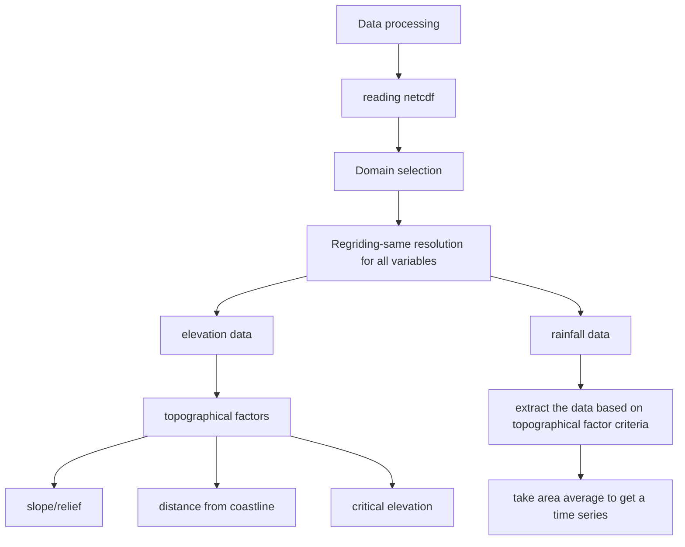

# Example repsitory for pyrates workshop 

# PYRATES_workshop - Reproducible Study

## Identifying the periodicity in rainfall over the Maritime Continent in relation to different topographical factors.

 Author: Sreedevi Puthiyamadam Vasu
 Date: created on June 4, 
 License:


The codes will repoduce the following image:


## Dataset used for the analysis
Study region: Maritime Continent ( 90°E-160°E; 10°N-11°S)
1. IMERG precipitation daily data for a period of  2000-2023. NASA's Integrated Multi-satellitE Retrievals for GPM (IMERG) Version 6 precipitation estimates (Huffman et al. 2019). Dataset is in netcdf format.
2. ETOPO1 bathymetry/topography data: The ETOPO1 global relief model is a high-resolution (1 arc-minute) digital elevation model (DEM) for Earth's surface. Dataset is in netcdf format.

### links to data:
1. IMERG:
2. ETOPO:

```
[](https://mybinder.org/v2/gh/LijoDXL/OceanographyWithPython/master)
[](https://github.com/LijoDXL/OceanographyWithPython/blob/master/LICENSE)

[](https://twitter.com/LIJODXL)

```

## Method: 
1. Extract precipitation data over mountainous regions (using information from etopo elevation data) for the study region.
2. Similarly extract precipitation data over planar regions (using information from etopo elevation data) for the study region.
3. Calculate the Fourier transform for analyzing the difference in periodicity of precipitation over high elevation versus planar region.


## Getting started

### The workflow


Input/Output table:

| Step | Input | Output | Code |
| --- | --- | --- | --- |
| Step 1 | etopo.nc; imerg.nc| L1_prepocessing_data.ipynb | 
| Step 2 | etopo.nc; imerg.nc| L1_prepocessing_data.ipynb | 


#### Step 1: Getting data ready and preprocessing.
Here is the flow chart for preprocessing:



Input/Output table:

| Step | Input | Output | Code |
| --- | --- | --- | --- |
| Step 1 | etopo.nc; imerg.nc| L1_prepocessing_data.ipynb | 


### Adding packages in your environment

Suppose you want to install a new package`conda install -c <channel-name> <package-name>`in your environment following the envlist.yml

### Do the preprocessing of data using pre


```


````

```{image} /assets/images/phdComic.jpg
:align: "center"
:scale: 50%
:name: PhdComic
```


