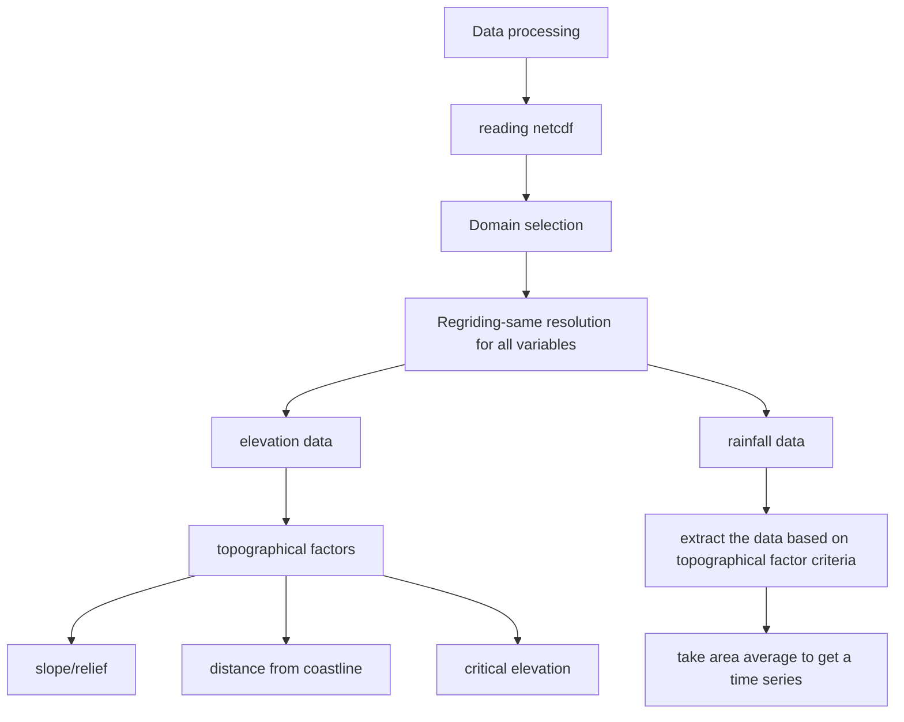
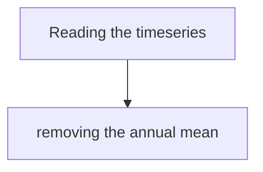

# Reproducibility Study for PYRATES workshop

## Identify the periodicity of rainfall over the Maritime Continent in relation to different topographical factors.

 Author: Sreedevi Puthiyamadam Vasu
 Date: created on June 4, 
 License:
 
[](https://zenodo.org/doi/10.5281/zenodo.11508508)
______________________________________________________________

The codes will reproduce the following image:


## Study region and Dataset used for the analysis
Study region: Maritime Continent ( 90°E-160°E; 10°N-11°S)
```geojson
{
  "type": "FeatureCollection",
  "features": [
    {
      "type": "Feature",
      "id": 1,
      "properties": {
        "ID": 0
      },
      "geometry": {
        "type": "Polygon",
        "coordinates": [
          [
              [160,-11],
              [160,-10],
              [90,-11],
              [90,10],
              [160,10]
          ]
        ]
      }
    }
  ]
}
```

1. IMERG precipitation daily data for the period of 2000-2023.
   NASA's Integrated Multi-satellitE Retrievals for GPM (IMERG) Version 6 precipitation estimates (Huffman et al. 2019). The dataset is in NetCDF format.
2. ETOPO1 bathymetry/topography data:
   The ETOPO1 global relief model is a high-resolution (1 arc-minute) digital elevation model (DEM) for Earth's surface. The dataset is in NetCDF format.

### links to data:
1. IMERG:
2. ETOPO:

## Method: 
1. Extract precipitation data over mountainous regions (using information from ETOPO1 elevation data) for the study region.
2. Similarly, precipitation data for the study region will be extracted over planar regions (using information from ETOPO1 elevation data).
3. Calculate the Fourier transform for analyzing the difference in periodicity of precipitation over high elevation versus planar region.


## Getting started

### Adding packages to your environment

Suppose you want to install a new package`conda install -c <channel-name> <package-name>`in your environment following the envlist.yml

### The workflow

Input/Output table:

| Step | Input | Output | Code |
| --- | --- | --- | --- |
| Step 1 | etopo.nc; imerg.nc| time_series1_mountain_vs_plain.nc| L1_prepocessing_data.ipynb | 
| Step 2 | time_series1_mountain_vs_plain.nc| FFT_results.nc| L2_spectral_analysis_visualization.ipynb | 


#### Step 1: Getting data ready and preprocessing.
Here is the flow chart for preprocessing:




#### Step 2: Spectral analysis.
Here is the flow chart for preprocessing:



```


````

```{image} /assets/images/phdComic.jpg
:align: "center"
:scale: 50%
:name: PhdComic
```


