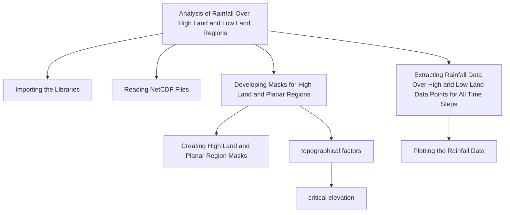
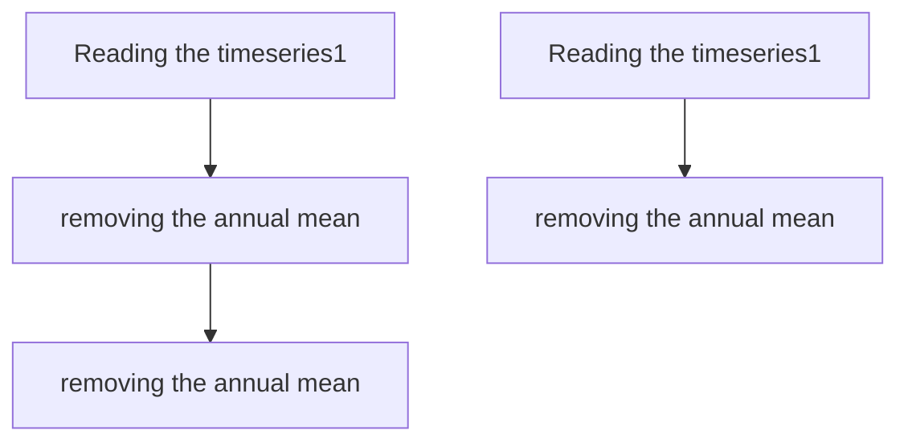

# Reproducibility Study for PYRATES workshop

## Identify the periodicity of rainfall over the Maritime Continent in relation to different topographical factors.

 Author: Sreedevi Puthiyamadam Vasu
 Date: created on June 4, 
 License:
 
[](https://zenodo.org/doi/10.5281/zenodo.11508508)
______________________________________________________________

The codes will reproduce the analysis/results from the manuscript: Sreedevi P. Vasu, Pallav Ray, Nirmal Mathew Alex, Nathaniel C. Johnson, Efthymios I. Nikolopoulos, and Sopia Lestari, 2024b; Spatial distribution of precipitation over the Maritime Continent and its dependence on topography, under preparation.
______________________________________________________________

## Study region and Dataset used for the analysis
Study region: Maritime Continent ( 90°E-160°E; 10°N-11°S)
```geojson
{
  "type": "FeatureCollection",
  "features": [
    {
      "type": "Feature",
      "id": 1,
      "properties": {
        "ID": 0
      },
      "geometry": {
        "type": "Polygon",
        "coordinates": [
          [
              [160,-11],
              [160,-11],
              [90,-11],
              [90,10],
              [160,10]
          ]
        ]
      }
    }
  ]
}
```

1. IMERG precipitation monthly data for the period of 2000-2023.
   NASA's Integrated Multi-satellitE Retrievals for GPM (IMERG) Version 6 precipitation estimates (Huffman et al. 2019). The dataset is in NetCDF format.
   https://gpm.nasa.gov/data/directory
2. ETOPO1 bathymetry/topography data:
   The ETOPO1 global relief model is a high-resolution (1 arc-minute) digital elevation model (DEM) for Earth's surface. The dataset is in NetCDF format.
   https://www.ncei.noaa.gov/products/etopo-global-relief-model
3. Derived data from ETOPO1 classifying data points into mountain, hill, and plains.
   Data enclosed.


## Method: 
1. Extract precipitation data over mountainous regions (using information from ETOPO1 elevation data) for the study region.
2. Similarly, precipitation data for the study region will be extracted over planar regions (using information from ETOPO1 elevation data).
3. Calculate the Fourier transform for analyzing the difference in periodicity of precipitation over high elevation versus planar region.


## Getting started

### Adding packages to your environment

Suppose you want to install a new package `conda install -c <channel-name> <package-name>`in your environment following the envlist.yml

### The workflow

Input/Output table:

| Step | Input | Output | Code |
| --- | --- | --- | --- |
| Step 1 | etopo.nc; IMERG_V07_2000_2023_monthly.nc; topographic_factors_etopo.nc| high_rain_lat_avg; high_rain_lon_avg;low_rain_lat_avg; low_rain_lon_avg | L1_prepocessing_data.ipynb | 
| Step 2 | high_rain_lat_avg; high_rain_lon_avg; low_rain_lat_avg; low_rain_lon_avg| diff_lat_avg; FFT_high_rain_lat_avg; FFT_low_rain_lat_avg; diff_lon_avg; FFT_high_rain_lon_avg; FFT_low_rain_lon_avg| L2_spectral_analysis_visualization.ipynb | 


#### Step 1: Getting data ready and preprocessing.
Here is the flow chart for preprocessing:


# 1. Analysis of Rainfall Over High Land and Low Land Regions

## 1.1 Importing the Libraries

## 1.2 Reading NetCDF Files

# 2. Developing Masks for High Land and Planar Regions

### 2.1 Creating High Land and Planar Region Masks

### 2.2 Plotting the High Land and Planar Points

# 3. Extracting Rainfall Data Over High and Low Land Data Points for All Time Steps

# 4. Plotting the Rainfall Data

# 5. Selecting the Domain of Interest and Calculating Mean Rainfall Along Longitude and Latitude

# 6. Plotting the Resulting Arrays

### 6.1 Plotting Mean Rainfall Across Different Latitudes

### 6.2 Plotting Mean Rainfall Across Different Longitudes

#### Step 2: Spectral analysis.


FFT Analysis of Rainfall Data Over High and Low Land Regions
## 1. Importing Data
## 2. Importing the Previous Notebook
## 3. Calculating FFT for High Land Rainfall (Latitude and Longitude Averages)
### 3.1 FFT of High Land Rainfall - Latitude Average
### 3.2 FFT of High Land Rainfall - Longitude Average
## 4. Calculating FFT for Low Land Rainfall (Latitude and Longitude Averages)
### 4.1 FFT of Low Land Rainfall - Latitude Average
### 4.2 FFT of Low Land Rainfall - Longitude Average
## 5. Plotting the FFT Results
## 6. Calculating and Plotting the Difference in FFT Magnitude
Here is the flow chart for step 2:



```


````

```{image} /assets/images/phdComic.jpg
:align: "center"
:scale: 50%
:name: PhdComic
```


